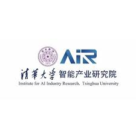
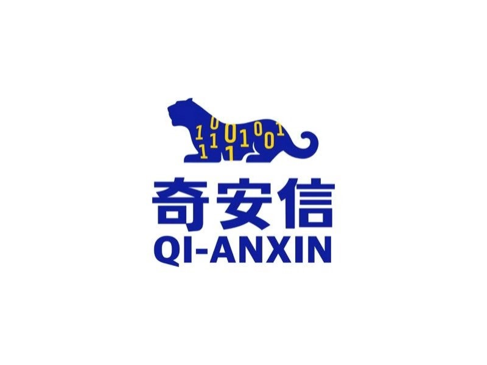
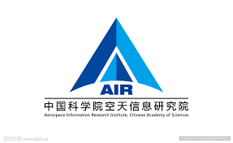

Welcome to my homepage. I am currently an MPhil student at the Hong Kong University of Science and Technology (HKUST), supervised by <a href="https://scholar.google.com/citations?user=NUV28h8AAAAJ&hl=en"><code>Associate Prof. Dasa Gu</code></a> and <a href="https://scholar.google.com/citations?user=sB519ukAAAAJ&hl=en"><code>Chair Prof. Alexis Kai Hon Lau</code></a> (JP, Head of ENVR, HKUST).  

I will be a PhD student at HKUST, majoring in IIP (AI, Data Science, and Remote Sensing) in Fall 2026, supervised by <a href="https://scholar.google.com/citations?user=NUV28h8AAAAJ&hl=en"><code>Associate Prof. Dasa Gu</code></a> and <a href="https://scholar.google.com/citations?user=dcDrhzMAAAAJ&hl=zh-CN"><code>Chair Prof. Pan Hui</code></a> (IEEE Fellow, MAE, FREng, ACM Distinguished Scientist)（IEEE会士，欧洲科学院院士，英国皇家工程院外籍院士，ACM杰出科学家），co-supervised by <a href="https://iap.cas.cn/sourcedb/zw/gbzjrc/ys/200908/t20090805_5548911.html"><code>Prof. Daren Lyu (Daren Lu or Daren Lv)</code></a>（Academician of the Chinese Academy of Sciences）（中国科学院院士）, <a href="https://ocac.zju.edu.cn/2020/0509/c50525a2094491/pagem.htm"><code>Prof. Delu Pan</code></a>（Academician of the Chinese Academy of Engineering）（中国工程院院士） and <a href="http://www.sdioi.com/ryxx/1541.html"><code>Prof. Peng Chen</code></a>（中国国家优青）.  

I also work closely with and am co-advised by <a href="https://scholar.google.com/citations?user=vzj2hcYAAAAJ&hl=en"><code>Prof. Liangpei Zhang</code></a> (IEEE Fellow, IET Fellow, 长江讲座教授), <a href="https://scholar.google.com/citations?user=ViEjhlsAAAAJ&hl=zh-CN"><code>Prof. Ruizhi Chen</code></a> (member of the Finnish Academy of Science and Letters; previous Director of the State Key Laboratory of Information Engineering in Surveying, Mapping and Remote Sensing)（芬兰人文与科学院院士，测绘遥感信息工程国家重点实验室前主任）, <a href="https://scholar.google.com/citations?user=MVFNsJgAAAAJ&hl=en"><code>Prof. Xiangyun Hu</code></a> (Head of the Department of Photogrammetry, WHU)（二级教授，武汉大学摄影测量系主任）, and <a href="https://scholar.google.com/citations?user=utTxEzYAAAAJ&hl=zh-TW"><code>Prof. Hui Lin</code></a> (FIEAS, FAcSS)（国际亚欧科学院院士，英国社会科学院院士） during my PhD.  

My research interests focus on Remote Sensing, Computer Vision, Autonomous Driving, and Machine Learning. I am also a research assistant at AIR, Tsinghua University, and an intern LLM autonomous driving algorithm engineer at Li Auto Inc. and Shanghai Innovation Institute, advised by <a href="https://air.tsinghua.edu.cn/en/info/1046/1652.htm"><code>Assistant Prof. Zhao Hao</code></a>, <a href="https://scholar.google.com/citations?user=Hfrih1EAAAAJ&hl=en"><code>Assistant Prof. Hongyang Li</code></a>, <a href="https://scholar.google.com/citations?user=E1aaa_kAAAAJ&hl=zh-CN"><code>Dr. Zhihui Hao</code></a>, and <code>Mr. Gaoqiang Wu</code>. I was selected for the Asian Future Leader Scholarship Program (AFLSP) for 2024–2026 (100 students per year from top Asian universities). I received my bachelor’s degree in Computer Science from the Macau University of Science and Technology (MUST) with the President Medalist Award, supervised by <a href="https://fie.must.edu.mo/id-1444/person/view/id-539.html"><code>Prof. Xiaolin Tian</code></a>. My Bachelor GPA at MUST is 3.84/4.00, and my MPhil Cumulative Grade Point Average (CGA) at HKUST is 4.30/4.30.

Education
======  
| Degree                          | Period        | Institution                                |  
| B.S.c in Computer Science    | 2020-2024     | Macau University of Science and Technology |  
| MPhil Student                   | 2024-2026     | The Hong Kong University of Science and Technology |  
| PhD Student (Expected)          | From Fall 2026| The Hong Kong University of Science and Technology |  

## Work Experiences

|  |  |
|---|---|
|  | **Intern LLM Autonomous Driving Algorithm Engineer — Li Auto & Shanghai Innovation Institute** *Nov. 2025 – present* Advised by <a href="https://air.tsinghua.edu.cn/en/info/1046/1652.htm"><code>Assistant Prof. Zhao Hao</code></a>, <a href="https://scholar.google.com/citations?user=Hfrih1EAAAAJ&hl=en"><code>Assistant Prof. Hongyang Li</code></a>, <a href="https://scholar.google.com/citations?user=E1aaa_kAAAAJ&hl=zh-CN"><code>Dr. Zhihui Hao</code></a> and <code>Mr. Gaoqiang Wu</code> |
|  | **Intern Engineer — Lightwheel AI Inc.** *Mar. 2025 – Sep. 2025* Advised by <a href="https://air.tsinghua.edu.cn/en/info/1046/1652.htm"><code>Assistant Prof. Zhao Hao</code></a> |
|  | **Research Assistant — AIR, Tsinghua University** *Jan. 2024 – present* Advised by <a href="https://air.tsinghua.edu.cn/en/info/1046/1652.htm"><code>Assistant Prof. Zhao Hao</code></a> |
|  | **Intern Network Security Engineer — QiAnXin (Macau) Inc.** *Jul. 2023 – Aug. 2023* |
|  | **Research Assistant — Lab for Space Research, The University of Hong Kong (HKU)** *Jul. 2023* |
|  | **Research Assistant — AIR, Chinese Academy of Sciences** *May 2023 – Jul. 2023* Advised by <a href="https://people.ucas.ac.cn/~shenzhanfeng"><code>Prof. Zhanfeng Shen</code></a> |
|  | **Research Intern — Peking University** *Jul. 2022 – Aug. 2022* Advised by <a href="https://sess.pku.edu.cn/info/1157/2012.htm"><code>Prof. Xiuwan Chen</code></a> |
|  | **Research Assistant — State Key Laboratory of Lunar and Planetary Sciences, Macau University of Science and Technology** *Jul. 2021 – May. 2024* Advised by <a href="https://fie.must.edu.mo/id-1444/person/view/id-539.html"><code>Prof. Xiaolin Tian</code></a> |

Awards & Prizes
======
1. the 2024-2026 Asian Future Leader Scholarship (AFLSP) Awardee.  
2. the 2024 Presidents Medalist Awardee of Macau University of Science and Technology (Only Selected 6 UG students from the whole university and 1 from the school of CSE).  
3. Awarded the 2020 - 2021, 2021-2022, 2022-2023 Dean' s Honour List in the School of Computer Science and Engineering, Macau University of Science and Technology.  
4. Awarded First Prize of the 2024 (19th) Cross-Strait and Hong Kong-Macao College Student Computer Innovation Competition Finals. (Including China Mainland, Taiwan, Hong Kong and Macao)  
5. Awarded First Prize of the 2024 Zhuhai-Macau Computer Design Competition (Big Data and Artificial Intelligence Technology Application Track).  
5. Awarded the Bank of China Scholarship for 2021 - 2022.  
6. Awarded the Dean' s Scholarship for 2021 - 2022 in the School of Computer Science and Engineering, Macau University of Science and Technology.  
7. Awarded 2023-2024 Academic Excellent Award in the Macau University of Science and Technology.  
8. Awarded the Grand (First) Prize in the annual finals of the 5th "Bei Dou Star" Innovation and Innovation Competition (Silk Road International Challenge) organized by China Satellite Navigation Association.
9. Awarded 2025 Dream Builder HKUST Entrepreneurship Center Funding.

Services:
------
Reviewer of: 2025 IROS (top conference in Robotics); IEEE Robotics and Automation Letters (top journal in Robotics); Signal, Image and Video Processing (JCR Q3)

Publications
------
1. Li C\*, Zhou K\*, Liu T\*, Wang Y\*, etal. 2025 International Conference on Robotics and Automation (ICRA 2025), AVD2: Accident Video Diffusion for Accident Video Description. (*Indicate Equal Contribution, Accepted, Core A*, Top Conference in Robotics), [DOI: https://arxiv.org/abs/2502.14801](https://arxiv.org/abs/2502.14801)
2. Ma Y\*, Huang Y\*, Li C\*, Chen S\*, Yang S, Zheng Y, Li J, Huan Y. 2024 IEEE Biomedical Circuits and Systems Conference (BioCAS), A Hybrid Brain-Computer Interface based Wearable Exoskeleton System for Fine-Grained Hand Rehabilitation. (*Indicates equal contribution, Published, Premier Conference in Biomedical Circuits), [DOI: https://ieeexplore.ieee.org/document/10798270](https://ieeexplore.ieee.org/document/10798270))
3. Li C, Liang ZX, Gu D, et al. Comprehensive Evaluation of Atmospheric Water Vapor Products from the First Operational Geostationary Hyperspectral Thermal Infrared Sounder (FY-4B/GIIRS). (Under Review)  
4. Li C, Cui H, Tian X. A Novel CA-RegNet Model for Macau Wetlands Auto Segmentation Based on GF2 Remote Sensing Images](https://doi.org/10.3390/app132212178). Applied Sciences, 2023. (Published, SCI JCR Q1, DOI: [10.3390/app132212178](https://doi.org/10.3390/app132212178))
5. Li C, Tian Y, Tian X, Zhai Y, Cui H, et al. An Advancing GCT-Inception-ResNet-V3 Model for Arboreal Pest Identification](https://doi.org/10.3390/agronomy14040864). Agronomy, 2024. (Published, SCI JCR Q1, DOI: [10.3390/agronomy14040864](https://doi.org/10.3390/agronomy14040864))  
6. Li C, Song M, Ma Y. A Novel TAME-RegNetY Model: Enhancing Plant Pest Identification for Sustainable Environmental Conservation. (Minor Revision, Under Third Round Review)
7. Chen S, Wang K, Pang W, Yang R, Chen Z, Gao R, Lau A, Gu D, Zhang C, Li C†. OSDA: A Framework for Open-Set Discovery and Automatic Interpretation of Land-cover in Remote Sensing Imagery. (Under Review now)
8. Yang Q, Ye B, Li C, Tian X. Unveiling Mars' Water Potential: A Novel Multi-scale Dynamic Sensory Field Algorithm for Mud Volcano Detection. (Major Revision, Under Second Round Review)    
9. Tian Y, Li C, Tian X. Image Feature Recognition Method, System, Electronic Device and Storage Medium](http://epub.cnipa.gov.cn/patent/CN118736345A). China Invention Patent, 2024. (Public, Substantive Review in Progress, [CN118736345A](http://epub.cnipa.gov.cn/patent/CN118736345A))
10. Li C, Cui H, Tian X. Remote Sensing Image Segmentation of Wetlands in Macau Based on Machine Learning. Journal of Physics: Conference Series, 2023, 2665:012006. (Published, DOI: [10.1088/1742-6596/2665/1/012006](https://doi.org/10.1088/1742-6596/2665/1/012006))
11. Li C, Chen S, Ma Y, Song M, Tian X, Cui H. Wheat Pest Identification Based on Deep Learning Techniques. 2024 IEEE 7th International Conference on Big Data and Artificial Intelligence (BDAI), 2024:87-91. (Published, DOI: [10.1109/BDAI62182.2024.10692889](https://doi.org/10.1109/BDAI62182.2024.10692889))
12. Cui H, Li C. Machine Learning Based River Segmentation with GF-2 Satellite Imagery. AIBDF '24: Proceedings of the 4th Asia-Pacific Artificial Intelligence and Big Data Forum, 2024:325-328. (Published, DOI: [10.1145/3718491.3718545](https://doi.org/10.1145/3718491.3718545))
13. Chen S\*, Li C\*, Ma Y\*, Liang J, Zhu J, Tian X. Deep Learning Techniques for Lunar Impact Crater Identification Based on CCD and DEM Data. In: Deligiannidis L, et al (eds) CSCE 2024. Communications in Computer and Information Science, vol 2262. Springer. (Published, DOI: [10.1007/978-3-031-85933-5_4](https://doi.org/10.1007/978-3-031-85933-5_4)) (*Co-first authors)
14. Cui H, Liang J, Li C, Tian X. [Improved Convolutional Neural Network with Attention Mechanisms for River Extraction](https://doi.org/10.3390/w17121762). Water 2025, 17:1762. (Published, DOI: [10.3390/w17121762](https://doi.org/10.3390/w17121762))
15. 李承, 崔瀚文, 田小林. [基於卷積神經網絡的澳門濕地遙感圖像分割研究](https://doi.org/10.58664/mustjournal.2024.12.007). 澳門科技大學學報（人文社會科學版）, 2024, 18(4):123-146. (Published, DOI: [10.58664/mustjournal.2024.12.007](https://doi.org/10.58664/mustjournal.2024.12.007))  
